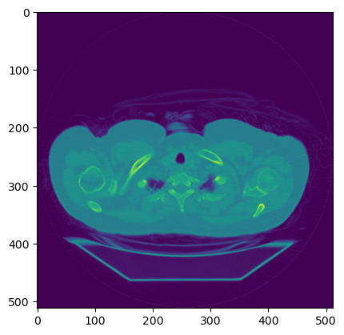

# Biomedical Image Analysis

> Analyse and treat biomedical images to explore computacional linear algebra concepts and learn how to use masks and filters to extract the necessary data.

<p align="center">
  <a href="https://www.linkedin.com/in/jhonatanguilherme/">
    
  </a>
  
  <a>
    
  </a>

  <a href="https://github.com/JhonatanGuilherme/ImageClassificationWithMNISTDataset/commits/main">
    
  </a>

  <a href="./LICENSE">
    
  </a>
</p>

## **📃 Explanation**
This project was created to study and analyse biomedical images with DICOM extensions, like this:



**DICOM** is an acronym for *Digital Imaging and Communications in Medicine*. Files in this format are most likely saved with either a DCM or DCM30 (DICOM 3.0) file extension.

The objective is to load the data images of a human chest, use necessary filters and understand how to see possible problems.

### Details
More technical details can be observed in the following file:
> [biomedical_image_analysis.ipynb](https://github.com/jhonatangopereira/BiomedicalImageAnalysis/blob/main/biomedical_image_analysis.ipynb)

## Steps
1. **Introduction**: Import the necessary libraries to read every DICOM medical image.
2. **Exploratory Data Analysis**: Load, construct and navigate in N-dimensional images using CT scans of human chests.
3. **Usage of masks and filters in biomedical images**: Use grayscales to facilitate the processing.
4. **Biomedical images measures and comparision**
5. **Conclusion**

## **🛠️ Technologies used**

The following technologies were used:
- Languages:
  - Python
- Libraries:
  ```python
  # Main library to resolve the problem.
  import imageio as iio
  # Library to help in images visualization.
  import matplotlib.pyplot as plt
  ```

## **📑 License**

This project is under the MIT license. See the **[LICENSE](./LICENSE)** file for more details.

Made with 🧡 by **[Jhonatan Oliveira](https://github.com/jhonatangopereira)**.
